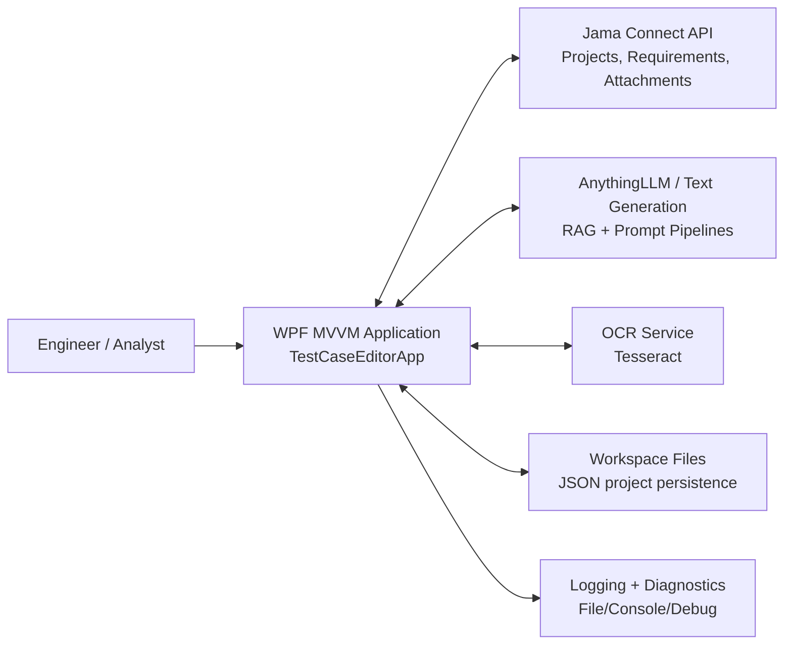
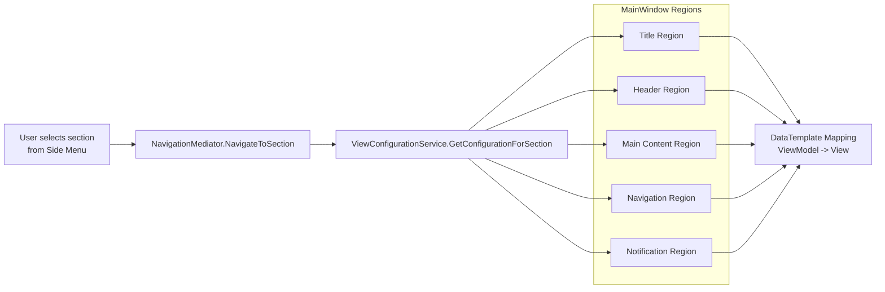
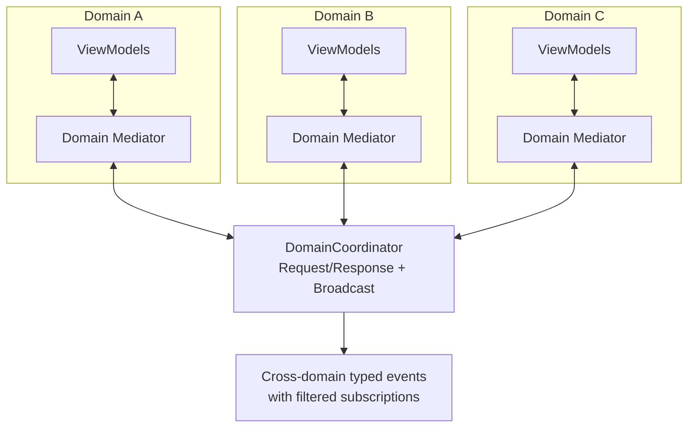
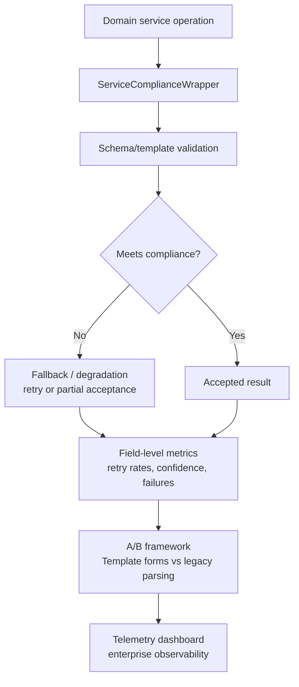
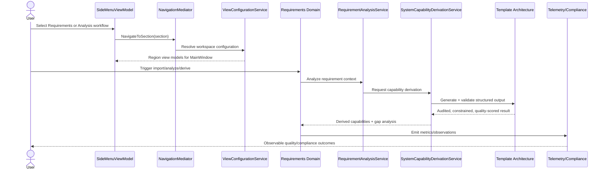

# TestCaseEditorApp: Detailed System Model (Boxes and Arrows)

This document provides a whiteboard-style architecture model of the application, from user interaction to domain orchestration, LLM-driven analysis, and enterprise telemetry.

## 1) System Context (Who/What Connects to the App)



## 2) Runtime Container View (Major Internal Subsystems)

```mermaid
flowchart TB
    subgraph UI[Presentation Layer]
        MainWindow[MainWindow\n5 Workspace Regions]
        SideMenu[SideMenuViewModel\nData-driven navigation]
        NavMediator[NavigationMediator]
        ViewConfig[ViewConfigurationService]
    end

    subgraph Domains[Domain Layer (MVVM + Mediators)]
        Startup[Startup Domain]
        Project[NewProject + OpenProject Domains]
        Requirements[Requirements Domain]
        TCG[TestCaseGeneration Domain\n(legacy but active)]
        TCC[TestCaseCreation Domain]
        TF[TestFlow Domain]
        TDV[TrainingDataValidation Domain]
        Notify[Notification Domain]
    end

    subgraph Services[Application Services]
        ReqSvc[RequirementService + SmartRequirementImporter]
        AnalyzeSvc[RequirementAnalysisService]
        DeriveSvc[SystemCapabilityDerivationService]
        JamaParser[JamaDocumentParserService]
        TemplateArch[Template Form Architecture\nConstraints + Envelopes + Self-Audit]
        Compliance[ServiceComplianceWrapper]
    end

    subgraph Infra[Infrastructure]
        DI[DI Host / App.xaml.cs]
        DomainCoord[DomainCoordinator\nCross-domain broker]
        Persistence[JsonPersistenceService]
        Monitoring[TelemetryDashboard + ABTesting + Quality Metrics]
    end

    MainWindow --> SideMenu
    SideMenu --> NavMediator
    NavMediator --> ViewConfig
    ViewConfig --> Domains

    Domains --> DomainCoord
    Domains --> Services
    Services --> Infra

    DI --> UI
    DI --> Domains
    DI --> Services
    DI --> Infra

    JamaParser --> TemplateArch
    AnalyzeSvc --> DeriveSvc
    DeriveSvc --> Compliance
    TemplateArch --> Compliance
    Compliance --> Monitoring
```

## 3) UI Composition Model (5-Region Workspace)



Notes:
- Some sections intentionally set shared title or navigation view models to null and render those concerns internally inside their own domain views.
- Rendering is type-driven via DataTemplates, keeping workspace composition declarative.

## 4) Domain Communication Model (Mediator + Broker)



Principles represented:
- Domain isolation by default.
- Typed messages for cross-domain communication.
- Broadcast and direct request/response supported through central broker.

## 5) ATP-to-Capability Derivation Pipeline (Detailed)

```mermaid
flowchart LR
    Input[ATP Steps + Requirement Sources\nJama attachments, imports, workspace data]
    Parse[ATPStepParser\nclassify and normalize steps]
    Prompt[CapabilityDerivationPromptBuilder\nstructured derivation prompts]
    LLM[LLM Inference\nAnythingLLM / text generation]

    subgraph TFA[Template Form Architecture]
      Envelope[IOutputEnvelopeService\nDeterministic output envelopes]
      Constraints[Constraint Engine\nHardReject / SoftRetry / FlagOnly]
      Audit[SelfAuditingTemplateService\nGenerate + self-audit]
      FieldQuality[IFieldLevelQualityService\nfield metrics and confidence]
    end

    Validate[TaxonomyValidator\nA-N capability taxonomy checks]
    Allocate[CapabilityAllocator\nsubsystem allocation]
    Score[DerivationQualityScorer\nmulti-dimensional quality]
    Gap[IRequirementGapAnalyzer\nderived vs existing requirements]
    Output[Derived capabilities + gaps + confidence + telemetry]

    Input --> Parse --> Prompt --> LLM
    LLM --> Envelope --> Constraints --> Audit --> FieldQuality
    FieldQuality --> Validate --> Allocate --> Score --> Gap --> Output
```



## 6) Compliance + Telemetry Control Loop



## 7) End-to-End User Journey (Operational Sequence)



## 8) How To Use This With Leadership

Use these 3 views in order during review:
1. System Context: shows why this is not just a UI app, but an integration and intelligence platform.
2. Runtime Container View: shows clear separations (UI, domains, services, infra).
3. Derivation Pipeline + Compliance Loop: shows engineered controls around LLM behavior.

Optional add-on for the next revision:
- Map each box to source files and owners for implementation governance.
- Add latency and reliability SLOs per edge for operational readiness.
- Add trust boundaries and security controls for enterprise architecture review.
